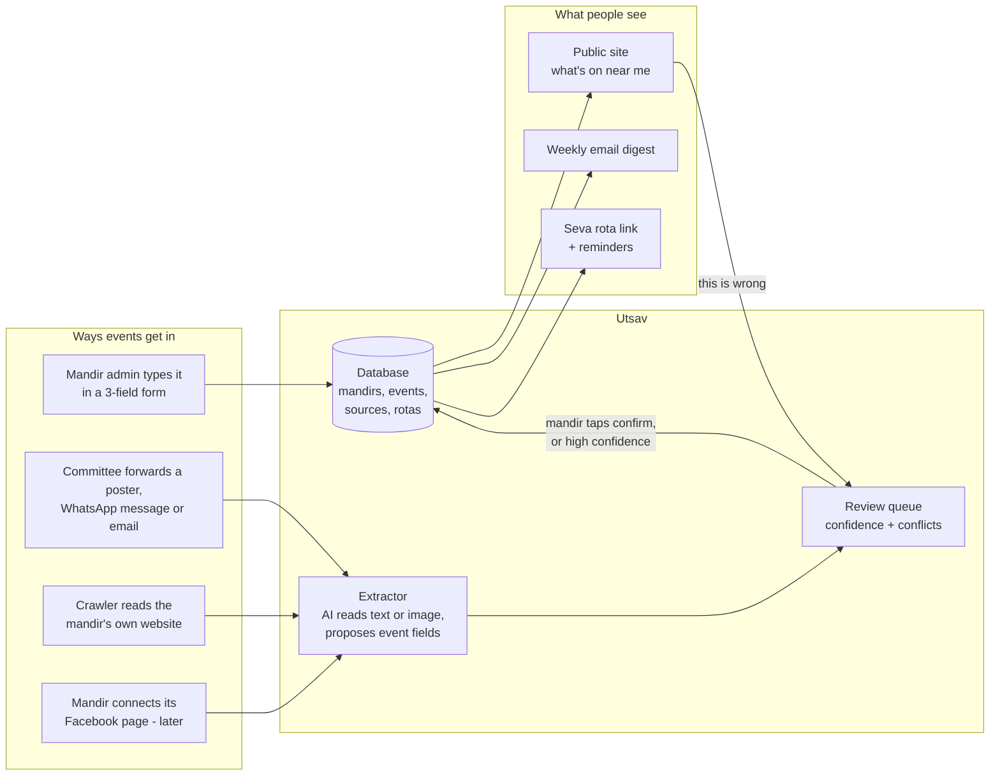
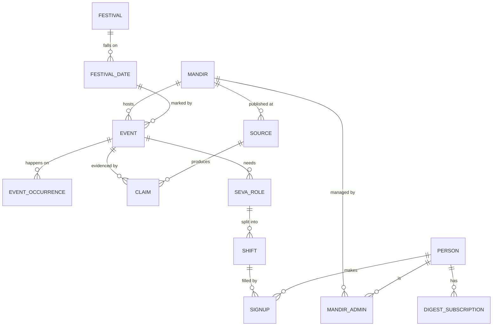

# Technical plan

How Utsav will be built: the parts, the data, how events get in and get
checked, and what the first version includes. It sits under
`docs/core-functions.md` (what we build and why) and `docs/launch-plan.md`
(when). Decisions behind it are logged in `docs/decisions/`.

Status: draft for review, 7 Oct 2026. Nothing here is built yet.

---

## 1. The system on one page

One web app serves three audiences from one codebase, each with its own area:

| Area | Who | What they do | Login |
| --- | --- | --- | --- |
| Public site | Families, devotees | Browse events by postcode and date, see festivals, sign up for the digest, take a seva slot | None to browse; email link to sign up |
| Mandir admin | Committee members | Add and confirm events, run a rota, see who signed up | Email or phone link, no password |
| Utsav admin | Milan and partner | Approve mandir claims, clear the review queue, remove content | Email link plus second factor |

It is a website that works like an app on a phone (installable to the home
screen). No App Store or Play Store apps until people ask for them
(decision 0002).

---

## 2. The data

This is the most important part to get right. Screens are easy to change
later; data is not.

| Thing | What it holds | Notes |
| --- | --- | --- |
| Mandir | Name, address, postcode, location, tradition, website, phone, charity number, claimed or not | Seeded from `outreach/mandirs_uk.csv` and the audit list |
| Mandir admin | Which person can edit which mandir, and their role | Several per mandir; can be removed |
| Event | Title, type, start and end, place, cost, link, status | Facts only; we link to the mandir's own page for posters and text |
| Event occurrence | Each actual date of a repeating event | "Every Saturday 7pm except during Navratri" lives here |
| Source | Where information comes from: website, forwarded message, admin entry, Facebook page, public report | Each with when it was last read |
| Claim | One source saying one thing about one event, with a confidence score | See section 4 |
| Festival / festival date | Navratri, Diwali, Ekadashi and so on, with the date per calendar tradition | Each mandir picks its own date; we never force one |
| Seva role / shift / signup | "Kitchen, night 3, 6–10pm, need 6", and who took it | Linked to an event |
| Person | Name, email or phone, consent flags | Kept to the minimum (section 6) |
| Digest subscription | Postcode, radius, frequency | No account needed |

Rules that save pain later:

- Every time is stored in UTC with the place's time zone; festival logic uses
  London sunrise, as in the prototype.
- Nothing is ever hard-deleted from events or claims; it is marked removed,
  so we can explain any listing.
- Every table that holds personal data has a stated retention period.
- Data is written through database migrations kept in the repo, never by
  hand in production.

---

## 3. Getting events in (making input easy)

The order of preference, easiest for a committee member first:

1. **Forward it.** A committee member forwards the poster, WhatsApp
   message or email they already made to an Utsav WhatsApp number or email
   address. The extractor reads it (text or image), fills in title, date,
   time and place, and sends back one message: "Navratri Garba, 11–19 Oct,
   8pm. Correct? Yes / Edit". One tap publishes it. This needs no new habit
   and no login.
2. **Three-field form.** What, when, any notes. Opened from a link in that
   same message; works on any phone; large text; Gujarati and other languages
   later.
3. **Crawler.** For mandirs that publish on their own website. Builds on
   `audit/audit.py`: respects robots.txt, stores facts only, offers same-day
   removal. Results go to the review queue, not straight to the site.
4. **Facebook page connection (later).** A mandir that wants to can connect
   its own page through Meta's official sign-in; we then read only that
   page's events and posts.

What we will not do (decision 0005): collect from Facebook or Instagram
pages without the owner's permission, or read WhatsApp groups. Both break
Meta's terms and would put the whole service at risk. The WhatsApp Business
Platform only lets people message us, which is what route 1 uses.

---

## 4. Checking events are right

Every event is a set of claims, each from a source with a confidence score
(decision 0004). The site shows the best-supported version and says where it
came from.

| Situation | What happens |
| --- | --- |
| Mandir admin entered or confirmed it | Published; shows "Confirmed by the mandir, [date]" |
| Crawler found it, high confidence, matches past pattern | Published as "From the mandir's website"; admin asked to confirm |
| Crawler or forward, low confidence | Review queue; not shown until confirmed |
| Two sources disagree (e.g. website says 7pm, poster says 8pm) | Flagged; the newer admin-confirmed claim wins; otherwise review queue |
| Public "this is wrong" report | Event marked "being checked"; admin and Utsav admin notified |
| Not confirmed for 30 days and in the future | Admin nudged; after 45 days shown as "unconfirmed" |

Design target: the review queue needs no more than 15 minutes a day from
us, even at 100 mandirs. If it needs more, we fix the rules, not add hours.

---

## 5. Seva rota

As in `docs/core-functions.md`: the admin creates roles and shifts for an
event, shares one link in their WhatsApp group, volunteers pick a slot with a
name and phone or email, and reminders go out the day before. The admin sees
which shifts are short. No points, no leaderboards. DBS checks and
supervision stay with the mandir; the rota can mark a role "needs DBS" but
does not hold certificates.

---

## 6. Privacy, safety and law

Knowing where someone worships or volunteers reveals their religion, which is
special category data under UK GDPR (decision 0006).

Before anyone's personal data is collected:

- [ ] Register with the ICO (about £50 a year for a small organisation)
- [ ] Data protection impact assessment (DPIA) for the digest and the rota
- [ ] Privacy notice, terms of use, and a cookie notice (we aim for no
      tracking cookies)
- [ ] Retention periods: rota signups deleted 90 days after the event;
      digest subscribers deleted 30 days after unsubscribing
- [ ] Under-18 volunteers: the signup asks for age band; under-16s need a
      parent's details and the mandir's sign-off
- [ ] Same-day removal process for mandirs and individuals

How the design keeps risk low: browsing needs no account; the digest needs
only an email and postcode; rota signups need a name and one contact; we do
not store which mandir someone "belongs to"; no analytics that track people
across sites.

---

## 7. Technology choices

Proposed (decision 0003), to be confirmed by both of us:

| Need | Choice | Why |
| --- | --- | --- |
| Language | TypeScript | One language for site, admin and background jobs |
| Web app | Next.js | Widely used, well documented, works well with Claude Code |
| Database and login | Supabase (Postgres) | Real database, email/phone login, row-level permissions, free tier |
| Hosting | Vercel, UK/EU region | Free to start, automatic preview copy for every change |
| Background jobs | Scheduled functions (crawler, digest, reminders) | No servers to manage |
| Email | Postmark or Resend | Reliable delivery for the digest and login links |
| WhatsApp | Personal number by hand in the pilot; WhatsApp Business Platform on a company number from v1 | Forward route and reminders; the platform is paid per message (decision 0008) |
| AI extraction | Claude API | Reads posters and messages into event fields |
| Errors and uptime | Sentry, plus an uptime check | Know before users tell us |
| Visitor stats | Plausible | No cookies, no personal tracking |

Estimated monthly running cost at pilot size (about 30 mandirs, 1,000
subscribers): under £50, most of it WhatsApp messages and AI extraction.
Check these figures against current prices before committing.

---

## 8. How we work on the code

- **Repo layout:** `app/` (the web app), `db/` (migrations and seed data),
  `jobs/` (crawler, digest, reminders), `docs/`, `audit/` (existing).
- **Every change** on a branch, through a pull request, with automated
  checks (tests, linting, type checks) that must pass before merging.
- **Three copies:** local, a preview for each pull request, and the live
  site. Secrets live in the hosting provider's settings, never in the repo.
- **Tests first where mistakes hurt:** festival dates and sunrise, repeating
  events, who can edit what, the confirm-by-reply flow.
- **Backups:** daily database backups, with one restore tested before launch.
- **Accessibility:** WCAG 2.2 AA; 18px minimum body text; works on a
  five-year-old Android phone on 4G.
- **Languages:** all text goes through a translation layer from day one;
  launch in English, add Gujarati first.
- **Decisions:** anything hard to reverse gets a short record in
  `docs/decisions/` before we build it.

---

## 9. First version (v1) — what is in and out

Built January–February 2027, launched in the pilot area in March (see
`docs/launch-plan.md`). Whether v1 includes the rota depends on the
mid-December decision point.

| In v1 | Not yet |
| --- | --- |
| Mandir list for the two pilot areas | Whole-UK coverage |
| Mandir claim and admin login | Payments, donations, ticketing |
| Forward-to-publish and three-field form | Facebook page connection |
| Crawler for mandirs with websites | Native iOS or Android apps |
| Review queue and "this is wrong" button | Our own panchang engine |
| Public listing by postcode and date, festival pages | AI chat assistant |
| Weekly email digest | WhatsApp digest |
| Seva rota with email reminders (if the December test supports it) | Live streaming, verified seva records |

Build order inside v1: data model and seed data → mandir admin and
forward-to-publish → public listing and digest → rota → crawler and review
rules → design polish.

---

## 10. Open questions

- Which pilot areas first: Harrow/Brent and Leicester, as planned, or
  wherever email replies are strongest?
- Who on each committee should be the admin, based on the email replies?
- Name check: trademark and domain for the final name before launch.

Settled: a limited company (decision 0007), and the personal WhatsApp number
for the pilot with a company number before automating (decision 0008).
